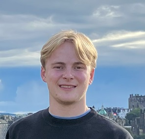

---
# Feel free to add content and custom Front Matter to this file.
# To modify the layout, see https://jekyllrb.com/docs/themes/#overriding-theme-defaults

layout: home
---

I'm currently building retrieval models with reinforcement learning at [SID.ai](https://www.sid.ai) in San Francisco.

While here, I've formally paused my PhD studies at the [distributed computing group](https://disco.ethz.ch/) at ETH Zurich. Before this, I did my undergraduate and master's studies at the University of Edinburgh, with an exchange at the University of Pennsylvania.

Are you a student looking for a thesis or collaboration? see my [university profile page](https://disco.ethz.ch/members/sdauncey) for current projects.